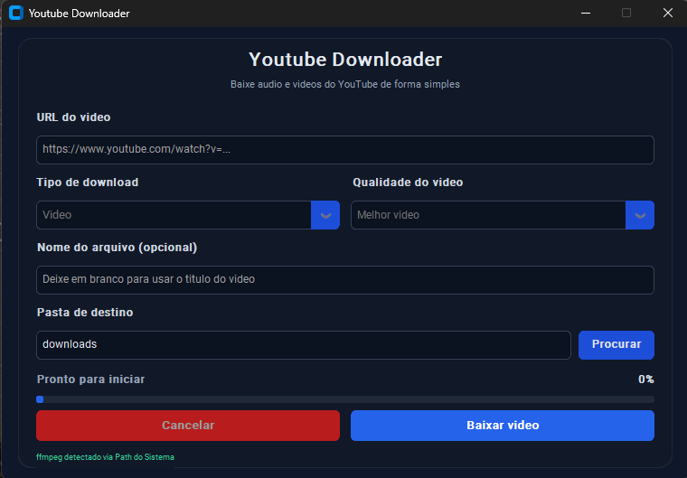

# Youtube Downloader (GUI)

Aplicacao desktop em Python para baixar video ou audio do YouTube com interface grafica simples, barra de progresso e cancelamento.

## Interface em execucao



> Dica: se quiser mostrar um print mais atualizado da tela, substitua o arquivo `assets/app.png`.

## Recursos

- Download de **video** em diferentes qualidades.
- Download de **audio** (melhor audio ou conversao com ffmpeg).
- Escolha de pasta de destino.
- Nome personalizado de arquivo (opcional).
- Barra de progresso + status em tempo real.
- Botao de cancelamento com limpeza de arquivos parciais.

## Requisitos

- Python 3.10+
- Dependencias do projeto (`requirements.txt`)
- `ffmpeg` (recomendado para melhor qualidade e conversoes de audio)

## Como executar a aplicacao (passo a passo)

### 1) Abrir a pasta do projeto

```powershell
cd "path your project\youtubedownloader"
```

### 2) (Opcional) Criar e ativar ambiente virtual

```powershell
python -m venv .venv
.\.venv\Scripts\Activate.ps1
```

### 3) Instalar dependencias

```powershell
python -m pip install --upgrade pip
python -m pip install -r requirements.txt
```

### 4) Rodar a interface

```powershell
python gui.py
```

## Como baixar um video ou audio do YouTube

1. Abra o app com `python gui.py`.
2. Cole a URL no campo **URL do video**.
3. Em **Tipo de download**, escolha:
   - `Video` para baixar video
   - `Audio` para baixar somente audio
4. Em **Qualidade**, escolha a opcao desejada.
5. (Opcional) Preencha **Nome do arquivo**.
6. Escolha a **Pasta de destino** (ou mantenha `downloads`).
7. Clique em **Baixar video** ou **Baixar audio**.
8. Aguarde ate o status de conclusao.

## Instalando ffmpeg no Windows

O `ffmpeg` melhora bastante a experiencia:

- Permite juntar melhor video + melhor audio.
- Habilita conversao para formatos como MP3/AAC/WAV.

### Opcao A (recomendada): Winget

```powershell
winget install --id Gyan.FFmpeg -e
```

### Opcao B: Chocolatey

```powershell
choco install ffmpeg -y
```

### Opcao C: Scoop

```powershell
scoop install ffmpeg
```

### Opcao D: Manual

1. Baixe em `https://ffmpeg.org/download.html`.
2. Extraia os arquivos em uma pasta (ex.: `C:\ffmpeg`).
3. Adicione `C:\ffmpeg\bin` no `PATH` do Windows.
4. Feche e abra o terminal novamente.

### Validar instalacao

```powershell
ffmpeg -version
```

Se o comando mostrar a versao, esta pronto.

## Solucao de problemas rapida

- `URL invalida`: confirme se comeca com `http://` ou `https://`.
- `ffmpeg nao encontrado`: instale o ffmpeg e abra o app novamente.
- Erro de rede: tente de novo ou troque de rede.

## Observacao importante

Use a ferramenta respeitando os Termos de Uso do YouTube e direitos autorais do conteudo baixado.
